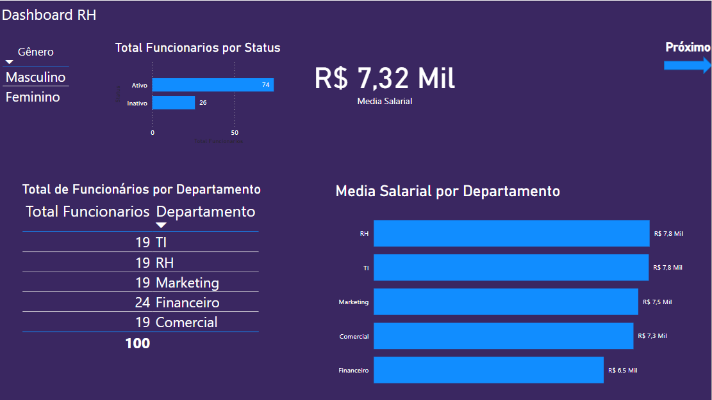
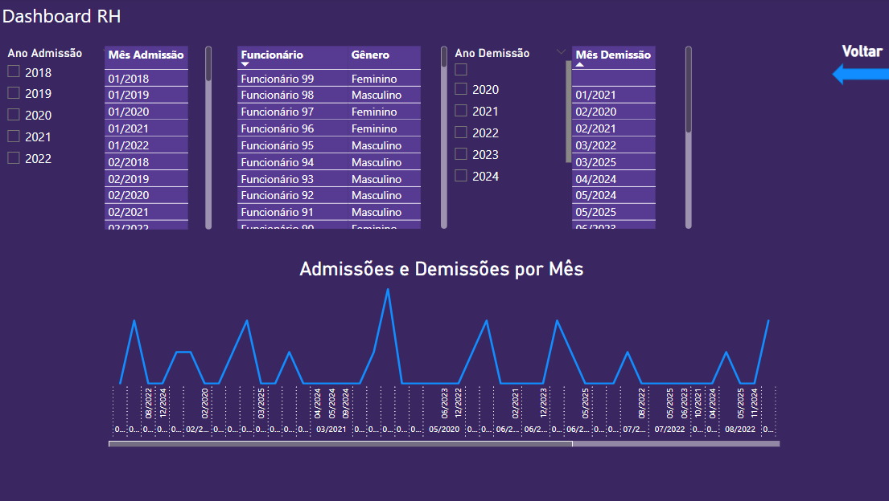
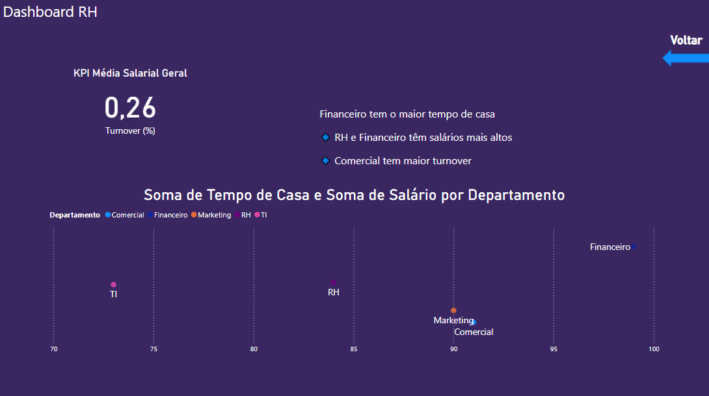

# 👥 rh-insights-powerbi

Este projeto tem como objetivo analisar dados fictícios de Recursos Humanos utilizando o **Power BI**, com foco em indicadores essenciais de gestão de pessoas, como rotatividade, distribuição por departamento e remuneração.

---

## 🎯 Objetivos do Projeto

- Visualizar o total de colaboradores e sua distribuição por status, gênero e departamento.
- Avaliar a média salarial geral e por setor.
- Medir o **turnover** (rotatividade) e o **tempo médio de casa** por colaborador.
- Identificar tendências de admissões e demissões ao longo do tempo.
- Explorar relações entre salário e tempo de empresa por departamento.

---

## 🛠️ Ferramentas Utilizadas

- Power BI Desktop
- Excel (para geração da base de dados simulada)
- DAX (para criação de medidas e colunas calculadas)
- Gráficos interativos, segmentações e KPIs

---

## 📊 Visões Criadas

### Página 1 – Visão Geral
- KPI: Média Salarial
- Gráfico: Total por Status (Ativo/Inativo)
- Gráfico: Total de Funcionários por Departamento
- Gráfico: Média Salarial por Departamento
- Segmentação por Gênero

### Página 2 – Filtros e Linha do Tempo
- Filtros por Ano e Mês de Admissão/Demissão
- Tabela com Funcionário e Gênero
- Gráfico de linha: Demissões por mês

### Página 3 – Análises Avançadas
- KPI: Turnover (%)
- Gráfico de dispersão: Tempo de Casa vs Salário por Departamento
- Gráfico de linha: Tendência de demissões por mês
- Insights destacados (recomenda-se caixa de texto)

---

## 🔍 Principais Métricas Criadas (DAX)

```DAX
Total Funcionários = COUNTROWS('Dados RH')
Funcionários Ativos = CALCULATE(COUNTROWS('Dados RH'), 'Dados RH'[Status] = "Ativo")
Funcionários Inativos = CALCULATE(COUNTROWS('Dados RH'), 'Dados RH'[Status] = "Inativo")
Turnover (%) = DIVIDE([Funcionários Inativos], [Total Funcionários], 0)
Média Salarial = AVERAGE('Dados RH'[Salário])
Tempo de Casa = 
VAR DataFim = IF('Dados RH'[Status] = "Inativo", 'Dados RH'[Data de Demissão], TODAY())
RETURN DATEDIFF('Dados RH'[Data de Admissão], DataFim, YEAR)
```

---

## 📂 Estrutura da Base de Dados

A base simulada contém os seguintes campos:

- `Funcionário`, `Gênero`, `Departamento`
- `Data de Admissão`, `Data de Demissão`, `Status`
- `Idade`, `Salário`
- `Mês Admissão`, `Mês Demissão` (colunas calculadas)

---

## 🖼️ Demonstração

### Página 1  


### Página 2  


### Página 3  


---

## 🧠 O que Aprendi

- Modelagem de dados voltada para RH
- Criação de KPIs estratégicos (turnover, tempo de casa)
- Uso de segmentações cruzadas e filtros temporais
- Construção de painéis de storytelling com navegação

---

## 🚀 Próximos Passos

- Adicionar comparação entre anos
- Implementar taxa de promoção e absenteísmo
- Integrar com banco SQL ou serviço em nuvem

---

## 📎 Arquivos incluídos

- `Dashboard_RH_PowerBI.pbix` – Arquivo Power BI
- `Dashboard_RH_PowerBI.xlsx` – Base de dados simulada
- Imagens (`pagina1.png`, `pagina2.png`, `pagina3.png`) – Capturas das páginas
